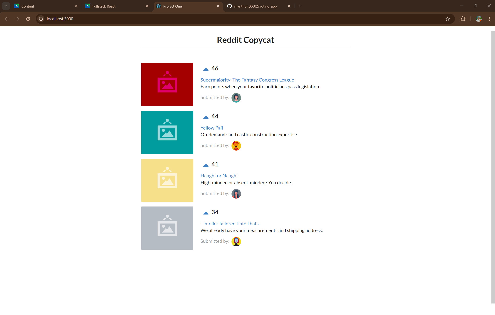

# Product Voting App

This is a simple React application that allows users to vote for their favorite products. The app displays a list of products, and users can upvote products they like. The products are sorted by the number of votes in descending order.

## Features

- Display a list of products with their details (title, description, image, etc.).
- Upvote products to increase their vote count.
- Products are automatically sorted by vote count.

## Technologies Used

- React
- JavaScript (ES6+)
- HTML/CSS (Semantic UI for styling)

---

## How to Run the Application

Follow these steps to run the application locally on your machine.

### Prerequisites

- Node.js and npm installed on your machine. Download them from [nodejs.org](https://nodejs.org/).

### Steps

1. **Clone the Repository**:

   ```bash
   git clone https://github.com/your-username/your-repo-name.git
   ```

2. **Navigate to the Project Folder**:

   ```bash
   cd your-repo-name
   ```

3. **Install Dependencies**:

   ```bash
   npm install
   ```

4. **Start the Development Server**:

   ```bash
   npm start
   ```

5. **Open the Application**:
   ```bash
   The app will open automatically in your browser at http://localhost:3000
   If it doesnt, manually navigate to http://localhost:3000
   ```

## Application Screenshot


